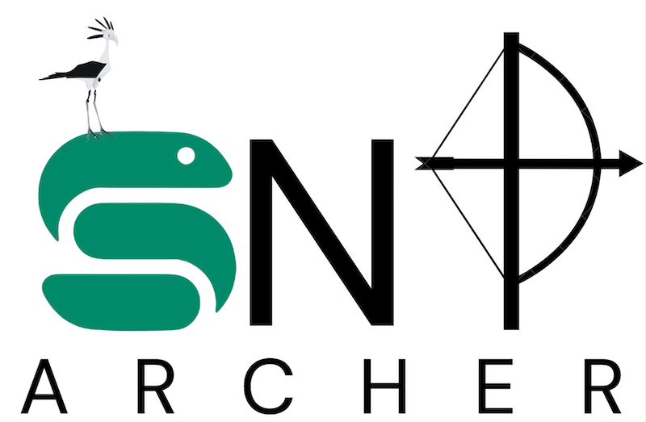

# snpArcher




snpArcher is a reproducible workflow optimized for nonmodel organisms and comparisons across datasets, built on the [Snakemake](https://snakemake.readthedocs.io/en/stable/index.html#) workflow management system. It provides a streamlined approach to dataset acquisition, variant calling, quality control, and downstream analysis.


## Fork of snpArcher

This is a fork of the original SNPArcher to add new features, including:
* make fastq and bam as temporary files to scale up to large datasets in smaller clusters (input fastq and intermediate bam files are removed on a per sample basis)
* the `quantize_cov` module implementing the mosdepth quantize method as in Laetsch et al. (2023)


### Test

```
conda activate snakemake
snakemake -d .test/ecoli --cores 1 --use-conda
```

### Usage

You first need to make a working directory, either within or outside the snpArcher directory.

Within your working directory you need to copy the `config/` directory and modify the settings (usually `config.yaml` and `samples.csv`) according to your analyses. You can add multiple sub-directories if you wish to run multiple datasets in parallel (e.g. `<your working directory>/<your dataset>/`). Snakemake will install a `.snakemake` config directory at the first run to install conda envs (it can take times).

Run the analyses from the snpArcher directory with :

```
snakemake --snakefile workflow/Snakefile --use-conda --cores <number of cores> --printshellcmds -d <your working directory>/<your dataset>/
```


## snpArcher Original

### Usage
For usage instructions and complete documentation, please visit our [docs](https://snparcher.readthedocs.io/en/latest/).

### Datasets generated by snpArcher
A number of resequencing datasets have been run with snpArcher generating consistent variant calls, available via [Globus](https://www.globus.org/) in the [Comparative Population Genomics Data collection](https://app.globus.org/file-manager?origin_id=a6580c44-09fd-11ee-be16-195c41bc0be4&origin_path=%2F). Details of data processing are described [in our manuscript](https://www.biorxiv.org/content/10.1101/2023.06.22.546168v1). If you use any of these datasets in your projects, please cite both the [snpArcher paper](https://www.biorxiv.org/content/10.1101/2023.06.22.546168v1) and the original data producers.

### Citing snpArcher
- Cade D Mirchandani, Allison J Shultz, Gregg W C Thomas, Sara J Smith, Mara Baylis, Brian Arnold, Russ Corbett-Detig, Erik Enbody, Timothy B Sackton, A fast, reproducible, high-throughput variant calling workflow for population genomics, Molecular Biology and Evolution, 2023;, msad270, https://doi.org/10.1093/molbev/msad270
- Also, make sure to cite the tools you used within snpArcher.
